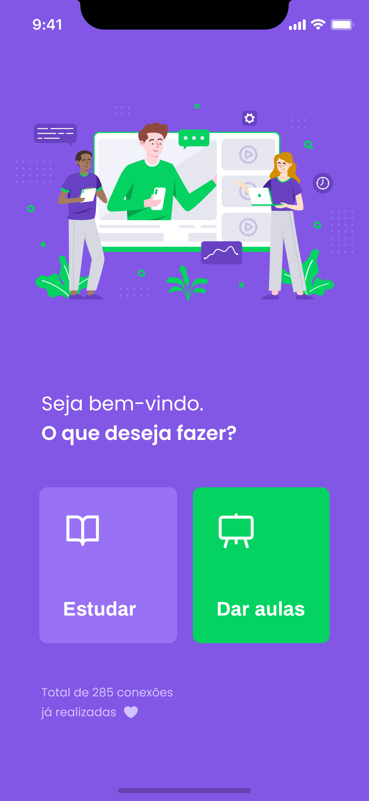

<h1 align="center">
    
</h1>

<p align="center">
  
  
  <a href="https://www.linkedin.com/in/luiz-araujojr/">
    
  </a>
  <a href="https://github.com/luiz-araujo/nlw-02/blob/master/LICENSE">
    
  </a>
</p>

<h3 align="center">
    
    <br><br>
</h3>

<p align="center">
  <a href="#nlw">Next Level Week</a>&nbsp;&nbsp;&nbsp;|&nbsp;&nbsp;&nbsp;
  <a href="#project">Project</a>&nbsp;&nbsp;&nbsp;|&nbsp;&nbsp;&nbsp;
  <a href="#layout">Layout</a>&nbsp;&nbsp;&nbsp;|&nbsp;&nbsp;&nbsp;
  <a href="#how-to-run">How to run</a>&nbsp;&nbsp;&nbsp;|&nbsp;&nbsp;&nbsp;
  <a href="#built-with">Built with</a>&nbsp;&nbsp;&nbsp;|&nbsp;&nbsp;&nbsp;
  <a href="#how-to-contribute">How to contribute</a>&nbsp;&nbsp;&nbsp;|&nbsp;&nbsp;&nbsp;
  <a href="#license">License</a>&nbsp;&nbsp;&nbsp;|&nbsp;&nbsp;&nbsp;
  <a href="#get-in-touch">Get in touch!</a>
</p>

## Next Level Week

NLW is a practical week with lots of code, challenges, networking and a single objective: to take you to the next level.
Through our method you will learn new tools, learn about new technologies and discover hacks that will boost your career.
An online and completely free event that will help you take the next step in your evolution as a dev.

## Project

Proffy is an online educational platform that helps teachers to connect with students and quickly promote private lessons where students can hire these professionals directly.

### Web


### Mobile

 

## Layout

To access the web layout use [Figma](https://www.figma.com/file/GHGS126t7WYjnPZdRKChJF/Proffy-Web?node-id=0%3A1).

To access the mobile layout use [Figma](https://www.figma.com/file/e33KvgUpFdunXxJjHnK7CG/Proffy-Mobile?node-id=0%3A1).

## How to run

#### Requirements

To clone and run the application you will need:

- [Git](https://git-scm.com)
- [Node](https://nodejs.org/)
- [Yarn](https://yarnpkg.com/)

From your command line:

```bash
# Clone this repository
$ git clone https://github.com/luiz-araujo/nlw-02.git

# Go into the folder repository
$ cd nlw-02
```

### API

```bash
# Go into the API folder repository
$ cd server

# Install dependencies
$ yarn install

# To create a new empty database (optional), go to src/database/ and remove 'database.sqlite' then run migrates:

# Run Migrates
$ yarn knex:migrate

# Start server
$ yarn dev:server

# running on port 3333
```

### Web

```bash
# in another tab of the terminal install the frontend dependencies and run it

# Go into the frontend repository
$ cd web

# Install dependencies
$ yarn install

# Run
$ yarn start

# running on port 3000
```

### Mobile

The Application was developed using Expo, a free and open source tool used in mobile development with React Native that allows easy access to the device's native APIs without having to install any dependencies or change native code. [Click here](https://expo.io/learn) to get start with Expo.

```bash

# Go into the mobile repository
$ cd mobile

# Install dependencies
$ yarn install

```

Before running the application on your device, you need to change the ip configuration.

[api.ts](https://github.com/luiz-araujo/nlw-02/blob/master/mobile/src/services/api.ts)

```javascript
  baseURL: "http://localhost:3333",
```

Replace localhost with your own machine's ip.

Then run the application.

```bash

# Run the app
$ yarn start

# Expo will open, just scan the QRCode on terminal or browser and wait for the app to load.

# If there is a problem with the fonts, run:
$ expo install expo-font @expo-google-fonts/archivo @expo-google-fonts/poppins

```

## Built With

- [NodeJS](https://nodejs.org/en/) - designed to build scalable network applications
- [ReactJS](https://reactjs.org/) - A JavaScript library for building user interfaces
- [React Native](https://reactnative.dev/) - A JavaScript library for developing native apps(iOS and Android)
- [Expo](https://expo.io/) - A module that give us access to a lot of cool stuff while developing React Native apps.
- [TypeScript](https://www.typescriptlang.org/) - TypeScript is a typed superset of JavaScript that compiles to plain JavaScript.

## How to contribute

- Make a fork;
- Create a branch with your feature: `git checkout -b my-feature`;
- Commit changes: `git commit -m 'feat: My new feature'`;
- Make a push to your branch: `git push origin my-feature`.

After merging your receipt request to done, you can delete a branch from yours.

## License

This project is under the MIT license. See the [LICENSE](https://github.com/luiz-araujo/nlw-02/blob/master/LICENSE) for details.

## Get in touch!

<a href="https://www.linkedin.com/in/luiz-araujojr/" target="_blank" >
  
</a>&nbsp;&nbsp;&nbsp;
<a href="mailto:luizcaj@yahoo.com.br" target="_blank" >
  
</a>

---

Made with ❤️ by Luiz Araújo.
